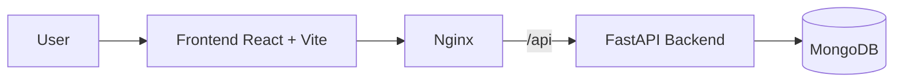
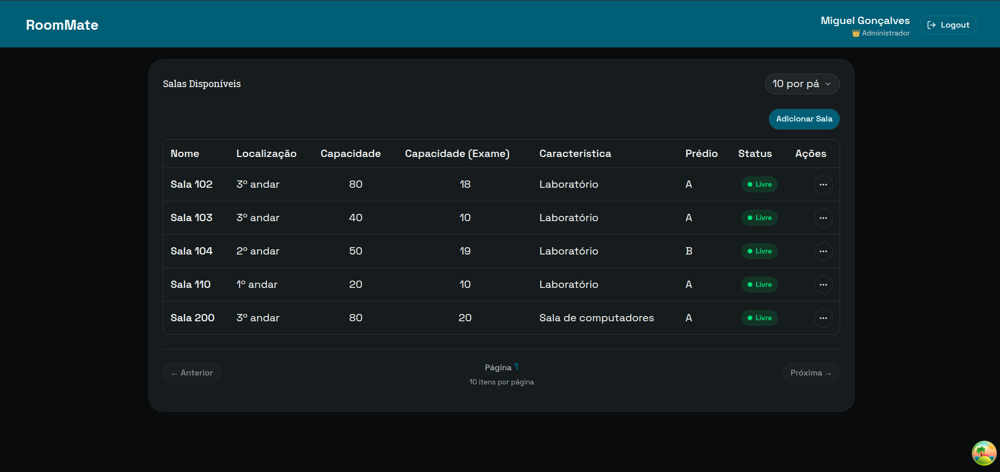

# WebServices | Full-Stack Room Reservation System

A full-stack project designed to solve a real problem: centralize room management, authenticate users, and prevent booking conflicts with a simple user experience and production-ready technical foundation.

If you're evaluating my profile as a recruiter, this project demonstrates the ability to deliver a complete end-to-end application, from frontend to backend, with containerization, reverse proxy, secure authentication, data validation, and production-focused design.

## The Problem This Project Solves

In environments such as schools, universities, or internal teams, room reservation typically fails for three reasons:

- manual and dispersed processes
- lack of visibility into availability
- scheduling conflicts and poorly defined permissions

This system addresses these issues with a centralized API, a management interface, and clear rules for reservations, users, and administrators.

## What the Application Does

- authentication with registration, login, logout, and session management via JWT in HTTP-only cookies
- role-based access control for regular users and administrators
- paginated dashboard listing available rooms
- room creation, editing, and deletion by administrators
- reservation creation and querying per room
- prevention of scheduling conflicts
- state management for rooms and reservations
- form validation on both frontend and backend

## Tech Stack

### Backend

- FastAPI
- MongoDB with Motor
- JWT with PyJWT
- password hashing with pwdlib/argon2
- validation and models with Pydantic
- Python 3.14

### Frontend

- React 19
- TypeScript
- Vite
- Tailwind CSS 4
- React Router
- TanStack Query
- TanStack Table
- Zustand
- React Hook Form
- Zod

### Infrastructure and Deployment

- Docker
- Docker Compose
- Nginx as static server and reverse proxy
- multi-stage build for frontend
- API exposed via `/api` in production

## Architecture



### Data Diagram


### Screenshot

Below is a screenshot of the rooms list UI used in the project:



The frontend is compiled and served by Nginx. In production, Nginx routes requests from `/api` to the backend, which simplifies API consumption and maintains SPA functionality with client-side routing.

## Technical Highlights

### Well-Defined Containerization

The project is prepared to run in containers with clear separation between frontend and backend.

- backend in slim Python image
- frontend in multi-stage build with Node and Nginx
- execution without root in containers
- Compose for local or production orchestration

### Reverse Proxy with Nginx

Nginx does more than serve static files. It also acts as a bridge between the frontend and API:

- rewrites `/api/*` requests to the backend
- adds internal proxy headers
- supports SPA fallback with `try_files`
- applies basic security headers
- blocks access to hidden files

### Security and Access Control

The backend includes production-grade decisions:

- JWT stored in HTTP-only cookies
- token validation in middleware
- role-based access control
- rate limiting to mitigate abuse
- CORS configured for frontend
- API documentation restricted in production

### Data Quality and UX

- form validation with Zod
- paginated queries to avoid heavy lists
- visual feedback with loading states and skeletons
- reusable table and component patterns
- predictable state management with Zustand and React Query

## Project Structure

```text
backend/
frontend/
docker-compose.yml
```

The backend concentrates business logic and persistence. The frontend focuses on user experience, consuming the API in a typed and predictable manner.

## Running the Project

### With Docker

```bash
docker compose up --build
```

Then open:

- frontend: `http://localhost`
- frontend alternative: `http://localhost:8080`

### Without Docker

Backend:

```bash
cd backend
uv sync
uv run fastapi run main.py --host 0.0.0.0 --port 8000
```

Frontend:

```bash
cd frontend
npm install
npm run dev
```

## Relevant Environment Variables

Backend:

- `MONGO_URL`
- `JWT_SECRET_KEY`

Frontend:

- `VITE_API_URL`

In production, the frontend uses `/api` as the base URL to communicate with the backend through Nginx.

## Production Notes

- The backend is designed to run behind the frontend proxy.
- API documentation may be restricted in production mode.
- Containers are designed to minimize attack surface.
- The frontend is delivered as optimized static assets.

## Why This Project Matters for Recruiters

This repository demonstrates more than a polished interface. It shows that I can take a business problem, translate it into a functional system, and deliver it with real production concerns:

- authentication and permissions
- frontend/backend integration
- data persistence
- containerization
- reverse proxy configuration
- validation and consistency
- deployment-ready infrastructure
